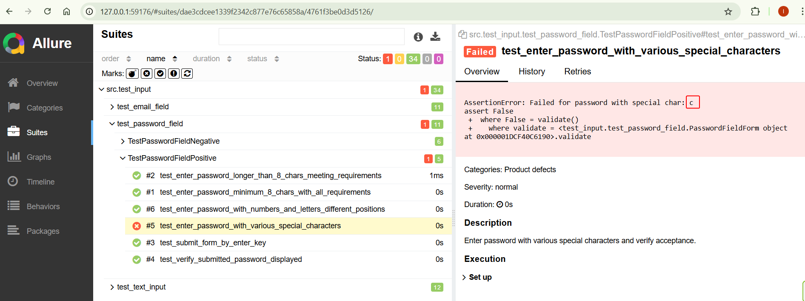

# That is a simple project to try skills for testing a web site using Playwright and Python

https://www.qa-practice.com/

## Installation

1. Create a project folder and cd into it
2. uv init --python 3.14
3. uv venv
5. uv add playwright
6. uv add pytest-playwright
7. uv add allure-pytest
8. playwright install

### Verifications:

## Execution

### Run all tests

pytest src/test_input/

### Run specific test file

pytest src/test_input/test_text_input.py -v

### Run the test and create allure report

python -m pytest src/test_input -v --alluredir allure-results
python -m pytest src/test_input/test_text_input.py -v --alluredir allure-results
python -m pytest src/test_input/test_email_field.py -v --alluredir allure-results

python -m pytest src/test_radio/test_radio_button.py -v --alluredir allure-results
python -m pytest src/test_alert/test_alert_dialog.py -v --alluredir allure-results
python -m pytest src/test_button/test_button.py -v --alluredir allure-results
python -m pytest src/test_checkbox/test_checkbox.py -v --alluredir allure-results
python -m pytest src/test_dragndrop/test_dragndrop.py -v --alluredir allure-results

### Open Allure report

allure generate
allure open

or 
allure serve

## Test results

### Alert notes

Each test class uses mock classes (AlertBox, ConfirmationBox, PromptBox) that simulate the behavior described in the scenario file. The tests validate the requirements like button presence, message display, user interactions, and modal behavior.

### Button notes

Each test class uses mock classes (SimpleButton, StyledLinkButton, DisabledButton) that simulate the behavior described in the scenario file. The tests validate button states, click responses, visual appearance, and interaction patterns.

### Checkbox notes

Each test class uses mock classes (SingleCheckbox, MultipleCheckboxes) that simulate the behavior described in the scenario file. The tests validate checkbox states, toggling behavior, submission results, and button states.

### Dragndrop notes

Each test class uses mock classes (BoxesDragDrop, ImagesDragDrop) that simulate the behavior described in the scenario file. The tests validate drag initiation, drop completion, state changes, constraints, and error handling.

### Iframe 

Generate the tests described inprompts/new_scenarios/iframe.scenario.md for Pytest framework and put them into src\test_iframe folder
Do not write the tests for Suggested missing tests sections
